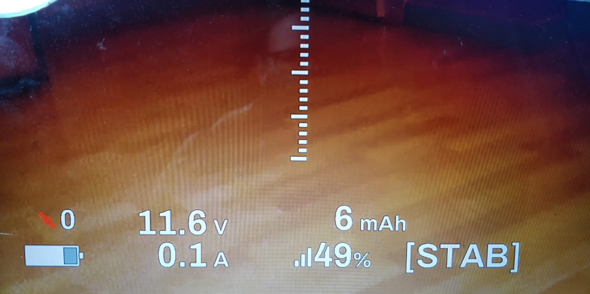

# ez-wifibroadcast-osd-mah
Bit of code to add mAh readings to the ez-wifibroadcast osd

## instalation

You need to have acces to the linux partion, you can do this by adding the files first to the normal sd card and coping them by plugging in a usb keyboard to the RX pi  
or installing ubuntu or other linux distrubution on a computer or VM  

Add render.c and render.h to linux partion /root/wifibroadcast_osd  
Add osdconfig.txt to normal sd partition (make shure you reset your own settings)  
or add:   
#define BATT_MAH  
#define BATT_MAH_POS_X 32
#define BATT_MAH_POS_Y 12  
#define BATT_MAH_SCALE 1  
  
  
When installing directly on raspberry, reboot afterwarts   

### info

if you like the feature or you want more features, let me know in the issues or email me at creal.fpv@gmail.com

